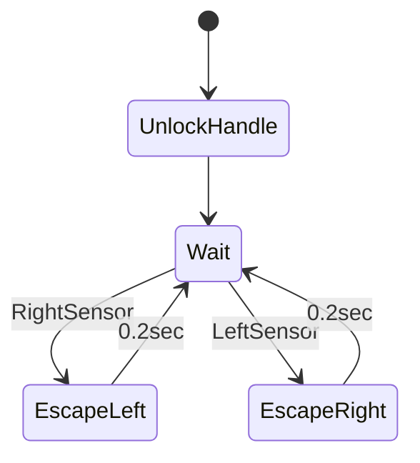

# HackUTOKYOv2Pim

## system design

```mermaid
stateDiagram-v2
    [*] --> UnlockHandle
    
    UnlockHandle --> Wait

    Wait --> EscapeLeft :RightSensor
    EscapeLeft --> Wait :0.2sec

    Wait --> EscapeRight :LeftSensor
    EscapeRight --> Wait :0.2sec
```

## 参考
https://pongsuke.hatenablog.com/entry/2019/08/08/172359
https://dev.classmethod.jp/articles/raspberrypi-opencv-monitoring/
